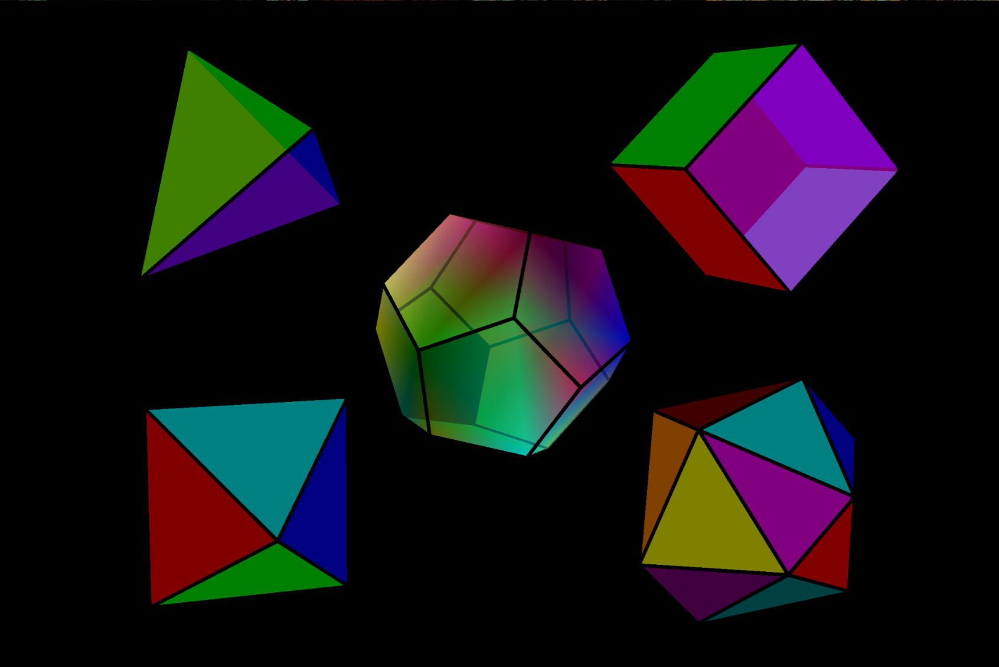

# p5.platonic

[p5.js](https://p5js.org/) library for rendering of [platonic solids](https://en.wikipedia.org/wiki/Platonic_solid).



# Usage

```js
platonic([length = 100], [center = createVector()], [colors], [fuse = false])
```

Where `platonic` can be one of the following solids: `tetrahedron`, `hexahedron` (or `cube`), `octahedron`, `dodecahedron`, `icosahedron`, or `solid`, which randomly selects one of the aforementioned solids. The optional `colors` array specifies colors for each vertex, and the `fuse` parameter determines if colors are blended across faces. Parameters can be provided in any order.

# Retained mode

Define retained mode `solid`:

```js
let solid

function setup() {
  beginGeometry()
  platonic(args) // see previous section
  solid = this.endGeometry()
  solid.clearColors() // optional
  solid.computeNormals() // optional
}
```

Render it as:

```js
function draw() {
  model(solid)
}
```

# Installation

Link the `p5.platonic.js` library into your HTML file, after you have linked in [p5.js](https://p5js.org/libraries/). For example:

```html | index.html
<!doctype html>
<html>
<head>
  <script src="p5.js"></script>
  <script src="p5.sound.js"></script>
  <script src=https://cdn.jsdelivr.net/gh/VisualComputing/p5.platonic/p5.platonic.js></script>
  <script src="sketch.js"></script>
</head>
<body>
</body>
</html>
```

to include its minified version use:

```html
<script src=https://cdn.jsdelivr.net/gh/VisualComputing/p5.platonic/p5.platonic.min.js></script>
```

instead.

# [vs-code](https://code.visualstudio.com/) & [vs-codium](https://vscodium.com/) & [gitpod](https://www.gitpod.io/) hacking instructions

Clone the repo (`git clone https://github.com/VisualComputing/p5.platonic`) and open it with your favorite editor.

Don't forget to check these [p5.js](https://p5js.org/) references:

1. [Library creation](https://github.com/processing/p5.js/blob/main/contributor_docs/creating_libraries.md).
2. [Software architecture](https://github.com/processing/p5.js/blob/main/src/core/README.md).
3. [Webgl mode](https://github.com/processing/p5.js/blob/main/contributor_docs/webgl_mode_architecture.md).